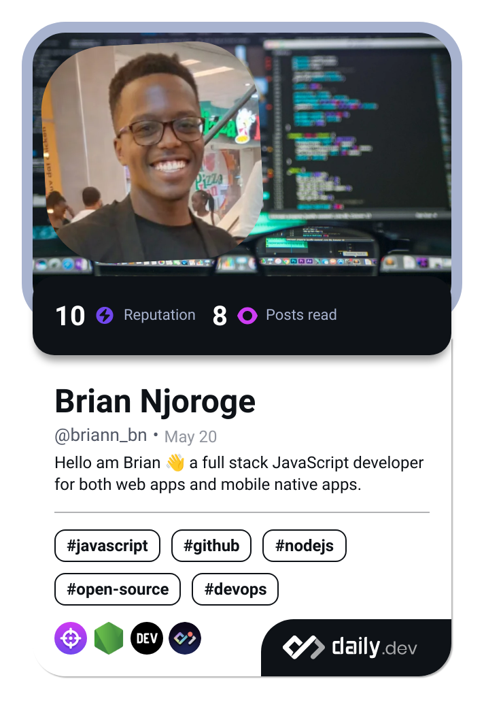

## Hi there 👋

<blockquote class="tiktok-embed" cite="https://www.tiktok.com/@bn_briann" data-unique-id="bn_briann" data-embed-type="creator" style="max-width: 100%; min-width: 100%;" > <section> <a target="_blank" href="https://www.tiktok.com/@bn_briann?refer=creator_embed">@bn_briann</a> </section> </blockquote> 

## My Daily.dev Profile

<!--
**addyxx-h4ck1/addyxx-h4ck1** is a ✨ _special_ ✨ repository because its `README.md` (this file) appears on your GitHub profile.

Here are some ideas to get you started:

- 🔭 I’m currently working on ...
- 🌱 I’m currently learning ...
- 👯 I’m looking to collaborate on ...
- 🤔 I’m looking for help with ...
- 💬 Ask me about ...
- 📫 How to reach me: ...
- 😄 Pronouns: ...
- ⚡ Fun fact: ...
-->
